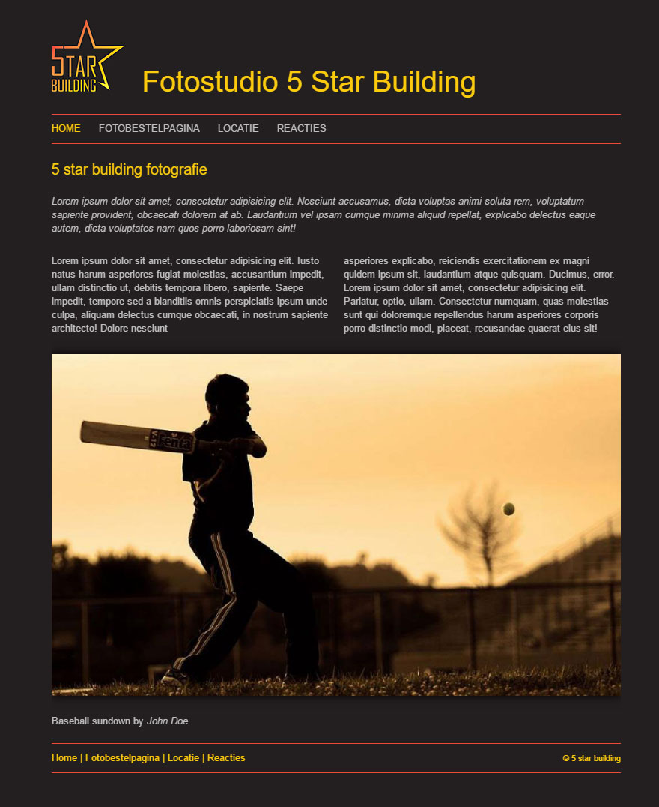
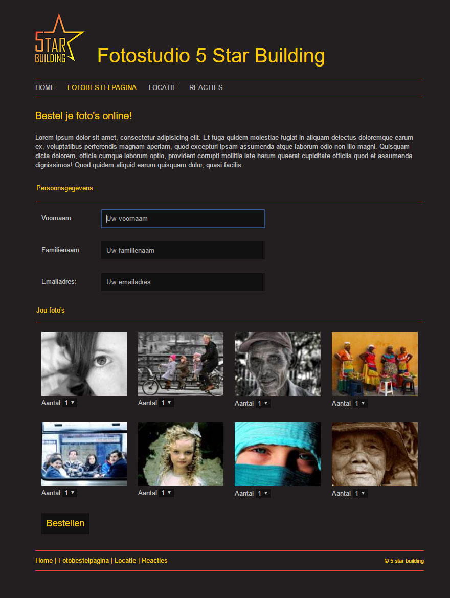
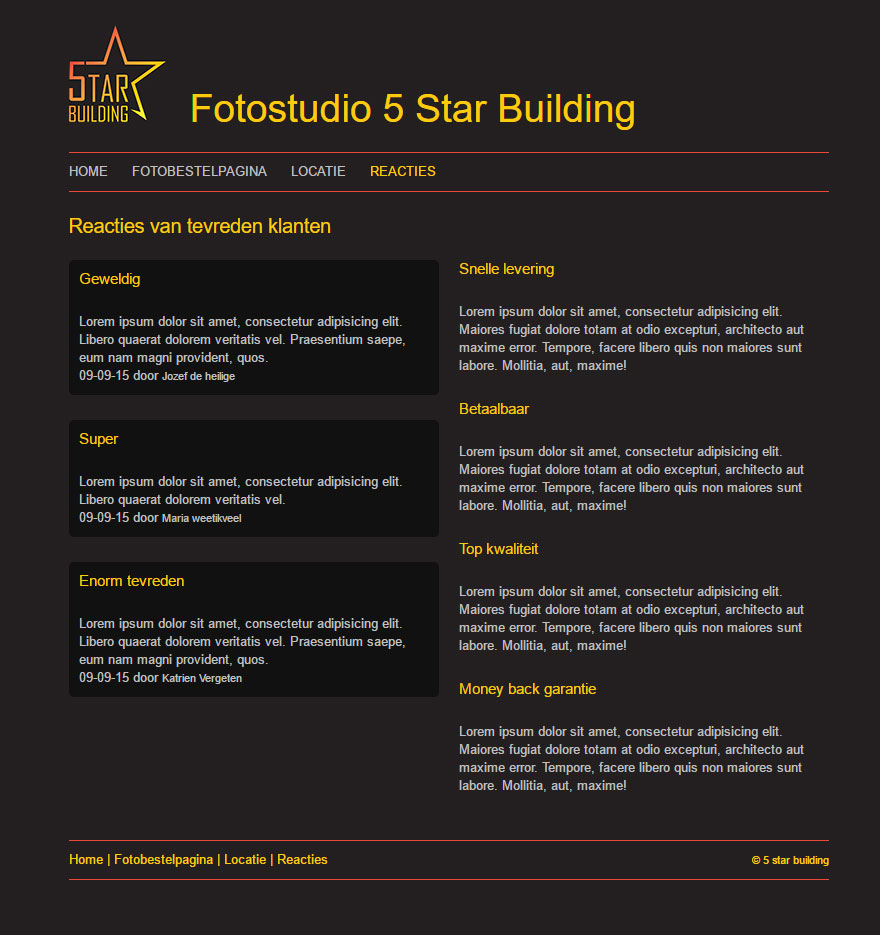

#HTML5 elements assignment

homepage 
  
Order pictures  
  
What people say

##Description
This was my final project for the HTML5 course at CVO de verdieping.  
This is a fictive site! I designed the 5star building logo but this project has nothing to do with FSB.  
Its pure about writing nice HTML5. No scripting, no preprocessors, no css methodology like using BEM.  

##Project rules
* Valid HTML & CSS
* Use of the new semantic elements
* No responsive or fluid design needed

##Used javascripts
* lightbox.js - _To popup the beautifull pictures_
* html5shiv.js - _offering html5 tag support for older browsers_

##@ Copyright notice
The logo is copyrighted, Do not use.